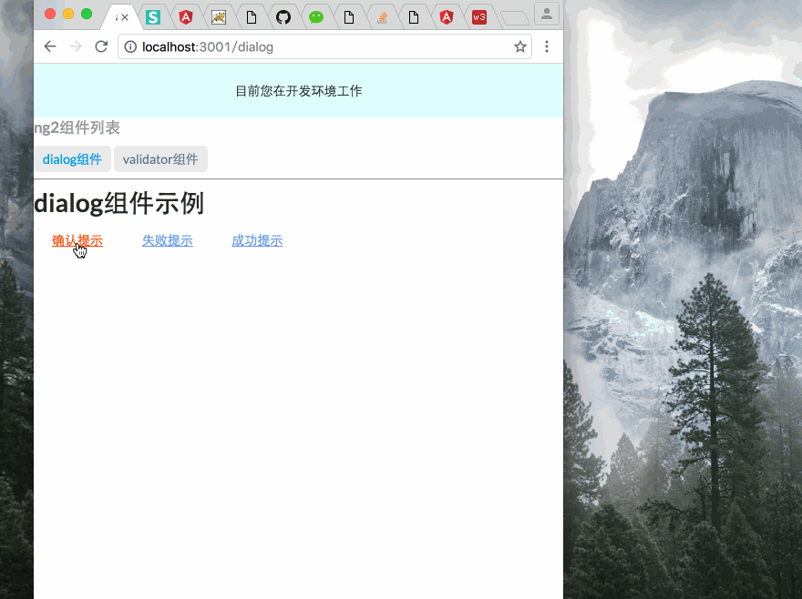
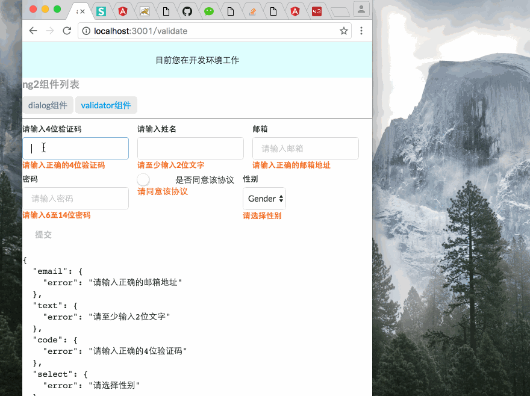

# ng2-components[ng2组件开发]
## 命令
```bash
    npm install [typings install ]
    npm start
    open localhost:3001
```

## 目录架构
|-app[逻辑代码]  

|-|- src [源代码]  

|-|- src/index [组件API列表]  

|-|- example [示例目录文件]  

|-|- example/dialog [dialog组件示例]  

|-|- example/validator [validator组件示例]  

## 目前已经集成的组件
##### dialog 弹出框


#### validator 表单验证


## ng2整体架构分析
- component为@directive中带有模板特点的指令
- directive指令
- service服务
- Dependency injection依赖注入
- provider [协同injector一起]
- eventEmitter 注册发布设计模式

## 写组件时,请参看如下angular2的API列表,保证组件的高质量
### [ng2的英文API列表](https://angular.io/docs/ts/latest/api/)
### [ng2中国镜像文档](http://a2.hubwiz.com/docs/ts/latest/api/)


## [本项目部分架构借鉴angular hero-list,感谢johnpapa](https://github.com/johnpapa/angular2-tour-of-heroes.git)

